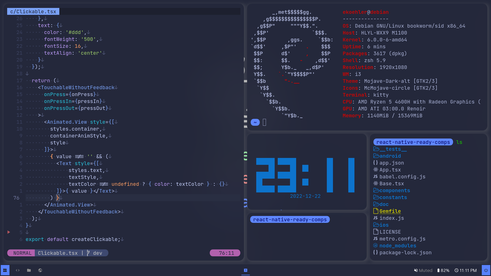
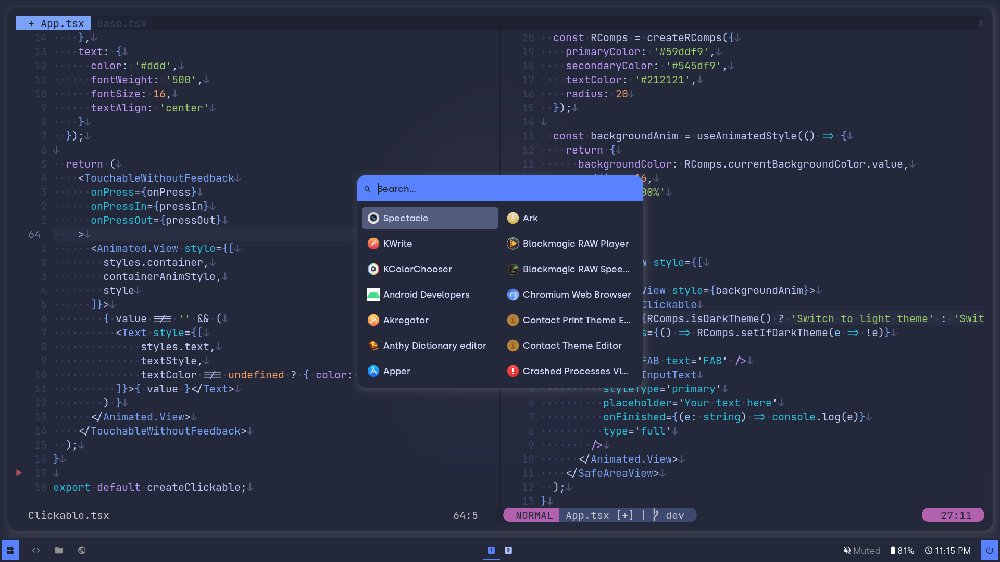
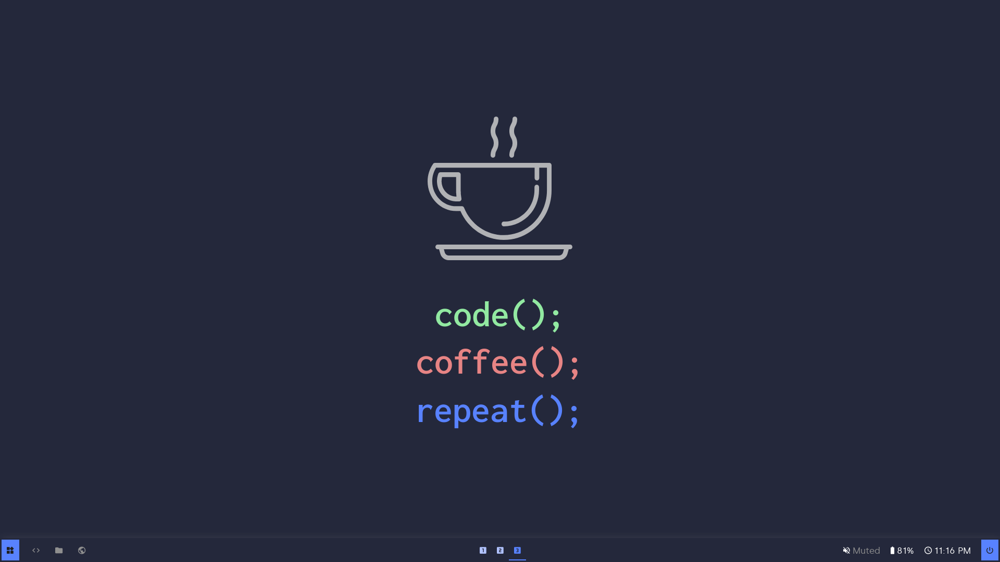

# Dotfiles neomorphism
At the end of 2022, I created this rice for my Debian i3-gaps laptop. I hope you will enjoy those dots !

## Installation

Most of these directories can just be copied in your `$HOME/.config` directory, but you should read the
readme I made for each directory to get more informations.

- [i3 documentation](i3/README.md)  
- [kitty documentation](kitty/README.md)  
- [nvim documentation](nvim/README.md)  
- [picom documentation](picom/README.md)  
- [polybar documentation](polybar/README.md)  
- [zsh documentation](zsh/README.md)  

## Gallery

  
  
  
  

## License

You can do whatever you want with these dots. Copy them, edit them, it's FOSS, relax !
